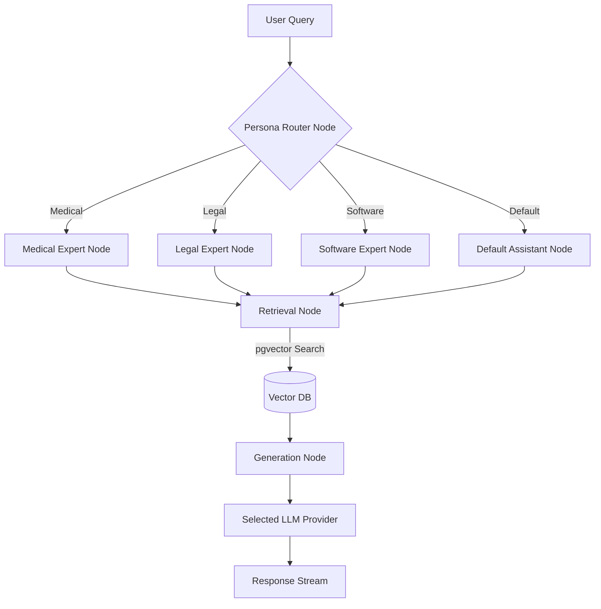

# Production-Grade Multi-Agent RAG Platform Implementation Plan

This document outlines the architecture, technology stack, and implementation phases for the proposed multi-agent RAG SaaS application. The goal is to build a highly scalable, full-stack application with a Next.js frontend, FastAPI backend, Supabase (Auth, Postgres + pgvector, Storage), and a robust LangChain/LangGraph AI pipeline.

> [!NOTE]
> This platform will be separated into a `frontend/` (Next.js 15) and `backend/` (FastAPI) structure to maintain a clean separation of concerns.

## User Review Required

> [!IMPORTANT]
> **Supabase Setup:** This project heavily relies on Supabase. Before full backend and frontend execution can begin, we will need to set up a Supabase project and obtain the necessary environment variables (`SUPABASE_URL`, `SUPABASE_KEY`, `SUPABASE_JWT_SECRET`).
> 
> **API Keys:** We will need API keys for the chosen LLM providers (e.g., `OPENAI_API_KEY`, `GEMINI_API_KEY`).
> 
> **Local vs Managed Database:** The plan assumes we will use a hosted Supabase instance for Postgres and Storage. Please confirm if this is acceptable or if you'd prefer to start with a local Dockerized Supabase instance for initial development.


## Proposed Architecture

### 1. Directory Structure

We will initialize a monorepo-style structure inside the workspace:

```text
c:\Users\BIT\Documents\GitHub\Pagewise
├── frontend/             # Next.js 15 App
├── backend/              # FastAPI Python App
├── docker-compose.yml    # For local development (Postgres, etc.)
└── README.md             # Project documentation
```

### 2. Frontend (Next.js)

- **Framework**: Next.js 15 (App Router)
- **Styling**: Tailwind CSS + shadcn/ui + Framer Motion
- **State Management**: Zustand (client state) + React Query (server state caching)
- **Auth**: `@supabase/ssr` for server-side auth validation and protected routes.
- **Key Components**:
  - `ChatInterface`: Streaming chat UI with markdown/code rendering and citations.
  - `Sidebar`: Collapsible sidebar managing chat history, personas, models, and documents.
  - `DocumentManager`: Drag-and-drop interface for uploading and viewing files.
  - `AnalyticsDashboard`: Visualizing usage metrics.

### 3. Backend (FastAPI)

- **Framework**: FastAPI (Python 3.12)
- **Database ORM**: SQLAlchemy + Alembic (Migrations)
- **Tasks**: FastAPI `BackgroundTasks` for asynchronous document parsing and embedding.
- **AI Core**: LangChain (RAG pipeline) and LangGraph (Agent routing and state).
- **Key Modules**:
  - `api/`: REST endpoints (auth, chat, docs, analytics).
  - `services/`: Business logic.
  - `agents/`: LangGraph definitions for multi-agent workflows (Router, Personas).
  - `rag/`: Document loaders, chunking, pgvector retriever.
  - `models/`: SQLAlchemy schema definitions.

### 4. Database Schema (PostgreSQL + pgvector)

- **Users**: Managed via Supabase Auth, linked to a custom `users` profile table.
- **Documents**: Metadata for uploaded files (URL, status, format).
- **DocumentChunks**: Contains `chunk_text`, `embedding_vector` (vector type), `document_id`.
- **Chats**: Chat session metadata.
- **Messages**: Individual messages in a chat (content, role, citations).
- **Personas**: Definitions for expert personas.
- **UserPreferences**: Default model, preferred persona, short/long-term memory state.
- **Analytics**: Aggregated metrics or raw event logs for usage tracking.

### 5. AI Architecture (LangChain & LangGraph)

**LangChain Usage:**
LangChain handles the underlying RAG pipeline and tooling:
- **Document Loaders:** Parsing PDF, DOCX, TXT.
- **Text Splitters:** Chunking text for optimal retrieval.
- **Embeddings:** Generating vector representations using LLM providers.
- **Retrievers:** Querying `pgvector` for similarity search.
- **Prompt Templates:** Formatting prompts with context and persona instructions.

**LangGraph Usage:**
LangGraph orchestrates the multi-agent workflow and maintains the state of the conversation graph:
- **State Management:** Tracking the conversation history, selected persona, and retrieved documents across a single execution cycle.
- **Routing:** A `Persona Router` node dynamically routes the user query to the appropriate specialized expert node.
- **Cycles/Graph Execution:** Executing the retrieval -> generation loop, allowing for complex decision-making (e.g., if an agent needs to retrieve multiple times).



## Implementation Phases

### Phase 1: Foundation & Infrastructure
- Initialize the monorepo structure.
- Setup `docker-compose.yml` for local dependencies (if not using hosted Supabase initially).
- Initialize the Next.js application with Tailwind CSS and shadcn/ui.
- Initialize the FastAPI application with Poetry/uv, SQLAlchemy, and Alembic.
- Define and run initial database migrations for all tables.

### Phase 2: Authentication & User Management
- Integrate Supabase Auth into Next.js (Login, Signup, OAuth).
- Secure FastAPI endpoints with JWT validation middleware.
- Implement Row Level Security (RLS) concepts at the application layer to ensure users only access their data.

### Phase 3: Document Pipeline & RAG Setup
- Implement the Document Manager UI in Next.js.
- Create FastAPI endpoints for file uploads (saving to Supabase Storage).
- Implement FastAPI `BackgroundTasks` for asynchronous document processing (PDF parsing, OCR for images).
- Implement chunking logic and embedding generation (LangChain).
- Store embeddings in `DocumentChunks` via pgvector.

### Phase 4: Multi-Agent & Chat Core
- Build the LangGraph workflow defining the Persona Router and specialized agents.
- Implement the RAG retrieval chain using LangChain.
- Create the streaming chat endpoints in FastAPI.
- Build the ChatGPT-like frontend interface with streaming support, markdown parsing, and citation display.

### Phase 5: Memory, Models, & Polish
- Implement Short-Term and Long-Term conversation memory mechanisms.
- Build the Model Selection UI and backend integration (OpenAI/Gemini router).
- Develop the Analytics Dashboard UI and corresponding backend aggregation logic.
- Comprehensive testing, error handling, and CI/CD workflow setup.

## Verification Plan

### Automated Verification
- Unit tests for FastAPI endpoints and LangChain retrieval logic (using `pytest`).
- Component tests for Next.js UI elements.
- Pydantic schema validation tests.

### Manual Verification
- End-to-end user flows: Sign up -> Upload Document -> Start Chat -> Select Persona -> Receive Streamed Answer with Citations.
- Verify that users cannot access documents or chat histories belonging to other users.
- Confirm background tasks successfully process large PDF documents without blocking the main API.
